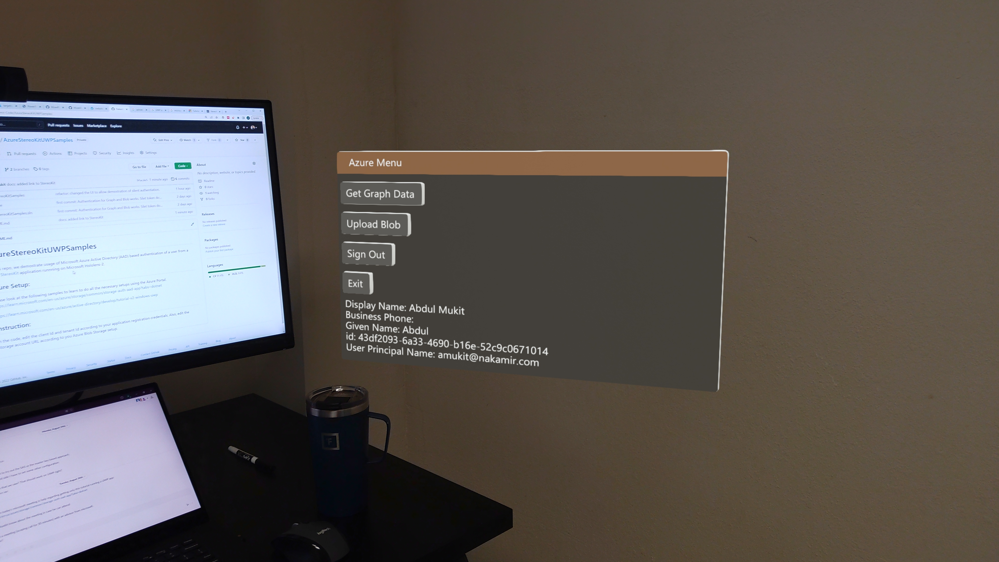

# Azure StereoKit UWP Samples
What’s the first thing that anyone creating any enterprise app will need to work out?
- Authentication

This repo contains a [StereoKit](https://stereokit.net/) sample application (for Microsoft Hololens-2) 
that demonstrates user authentication using Microsoft Azure Active Directory.

The application has demonstrations of:
* Logging in / authenticating users via Azure Active Directory before they can use the StereoKit application.
* Token acquisition using MSAL in a StereoKit-UWP application running on HoloLens 2.
* Acquires the access token to upload a blob to Azure Blob Storage and then read back its contents.
* Demonstrates both silent and interactive token acquisition.

## Azure Setup:
Please look at the following samples to learn to do all the necessary setups using the Azure Portal.  
https://learn.microsoft.com/en-us/azure/storage/common/storage-auth-aad-app?tabs=dotnet

https://learn.microsoft.com/en-us/azure/active-directory/develop/tutorial-v2-windows-uwp

## Instruction:
In the code, edit the client Id and tenant Id according to your application registration credentials. 
Also, edit the storage account URL according to you Azure Blob Storage setup.

### Contribution:
We made the code open-source so that other StereoKit developers can also start using them in building their 
enterprise applications.
Some of the next features we are intersted in are:
* Instead of typing in user-name and password, we are more intestesd in eye-scan + AAD based authentication.
* Having a sample that demostrates upload of blob data to different storage accounts depending on which tenant the logged in
user is from. e.g. If someone logs in from Company A, he/she will be automatically be uploading to a Azure Storage
Account dedicated for that Company A. Similarly, if a user logs in from Company B, then the link to the blob 
storage acccount automatically updates. Currently, this storage account link is hardcoded into the program.

### Considerations for UWP
The ``Microsoft.Identity.Client` pacckage (discontinued support for UWP)[https://github.com/AzureAD/microsoft-authentication-library-for-dotnet/issues/4427#issuecomment-2119973049], so the latest version must be 4.47.2 (the latest version not listed as vulnerable).
